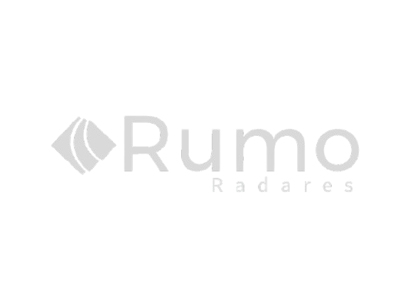

#  Sistema de notificações - Protelt 

## 📌 Sobre o sistema

### Este sistema foi desenvolvido para facilitar a criação das notificação de autuação por infração de velocidade máxima permitida, desenvolvida inicialmente para a empresa Protelt em Itu/SP.

## 🧠 Critérios pontuados para o sistema
- ✔️ Ser simples, rápido e útil.
- ✔️ Deve ter as opções de:
        - Visualizar todas as notificações.
        - Buscar todas as infrações de uma certa placa.
        - Criar novas infrações.
        - Editar / Deletar infrações.
- ✔️ Na sua primeira versão deve rodar somente para um único usuário.
- ✔️ O sistema deve ficar no servidor da empresa.

## 🎯 Objetivos principais com esse sistema
- ✔️ Reduzir o tempo gasto na criação de notificações.
- ✔️ Melhorar a organização e rastreamento de infrações.
- ✔️ Tornar o processo mais eficiente e menos propenso a erros.

#

## 🖥 Tecnologias Utilizadas
<div align='center'>


</div>

    - Next
    - React
    - Typescript
    - Css Modules

## Versões utilizadas:
    - Next: 15.1.5
    - React: 19.0.0
    - Typescript: 5

## 🙋🏻‍♂ Como me localizar no projeto?

### Todos os arquivos de código fonte do projeto estão em: `./src`

## 🛈 Como o projeto está estruturado

- `./src/app:` Este projeto é em Next e usando o App Router, então cada pasta é uma rota. Dentro do app temos: 
  - layout.tsx: Importa estilos globais, configura metadados (como título e descrição), e encapsula a aplicação.
  - page.tsx: Nossa primeira rota, também chamado como o nosso "home"

- `./src/assets:` Onde está todas as fotos e arquivos estáticos que vão ser usadas no projeto.

- `./src/components:` Onde está os componentes que serão reutilizados em diversas partes do código. Neste projeto temos os components:
    - Botões: Buttons
    - Cabeçalho: Header

- `./src/styles:` Pasta que contém os arquivos de estilização. Nesta primeira versão temos também um único arquivo, chamado "GlobalStyles.css", este arquivo fica responsável pelos códigos que são de estilização globais do projeto.

## ❔ Como rodar o projeto na minha máquina?

- Antes de tudo, você precisa ter o Git instalado no seu computador. O Git é uma ferramenta que permite clonar e gerenciar repositórios de código.
    - Windows: Baixe o Git <a href="https://git-scm.com/download/win" target="_blank">aqui</a> e siga as instruções de instalação.
    - macOS: Você pode instalar o Git <a href="https://git-scm.com/download/mac" target="_blank">aqui</a> ou usando o Homebrew com o comando brew install git:
        ```bash
        brew install git
        ```
        
    - Linux: Use o gerenciador de pacotes da sua distribuição, por exemplo para Debian/Ubuntu:
        ```bash
        sudo apt install git
        ```
        

- Abra o terminal (no Windows, você pode usar o Git Bash, que é instalado junto com o Git).

- Navegue até o diretório onde deseja armazenar o projeto.

- Execute o comando para clonar o repositório:

    ```bash
    git clone https://github.com/GuilhermeFranciscoPereira/Capputeeno.git
    ```
    
- Após clonar o repositório, navegue até a pasta do projeto
    ```bash
    cd Capputeeno
    ```
    

- Agora você pode abrir os arquivos do projeto com seu editor de texto ou IDE preferido. Exemplo do vsCode: 
    ```bash
    code .
    ```

- 🚨 Não esqueça que para não ocorrer erros no código ao clonar ele, você deve fazer o comando abaixo 🚨
    ```bash
    npm i   
    ```
    
- Ao ter o projeto na sua máquina você deve abrir a api e também o site. Para isso siga os passos abaixo:
  - Abra o terminal e escreva o código abaixo para iniciar a api:
    - 1:
      ```bash
      cd src/api
        ```
      
    - 2:
        ```bash
        npm start
        ```
      
  - Para abrir o site rode o comando:
    ```bash
    npm run dev
    ```
    

- Pronto! Todo o site estará funcionado na sua máquina. Porém, caso precise de alguma ajuda em algo entre em contato comigo pelo meu LinkedIn: https://www.linkedin.com/in/guilherme-francisco-pereira-4a3867283

## ⚠️ Informações importantes sobre o projeto ⚠️

### Todos os commits do projeto possuem um readme detalhado do que foi feito naquele commit e também possuem as fotos versão do site naquele momento, então caso deseje ver o processo de criação do código viaje pelos commits e veja as informações!

### Como fazer isso? 

Para você ver o processo de criação e o que foi feito em cada commit siga o passo-a-passo:

#### 1 - Nessa guia em que você está, suba a tela até encontrar embaixo do botão verde um local igual o da foto abaixo e então clique nele


#### 2 - No lado direito dos commits você encontra clique no simbolo de <> como está na foto e então você irá encontrar como o código estava naquele momento e o readme detalhado daquele momento!


#### 3 - Depois de encontrar tudo que deseja, caso queira voltar para cá, você irá clicar no local em que a imagem a baixo mostra:


#### E então clique em main e voltará para cá!

##

## 🎉 É isso! Esse é o nosso sistema, caso tenha ficado com alguma dúvida ou deseje complementar algo diretamente comigo você pode estar entrando em contato através do meu LinkedIn:
> Link do meu LinkedIn: <a href="https://www.linkedin.com/in/guilherme-francisco-pereira-4a3867283" target="_blank">https://www.linkedin.com/in/guilherme-francisco-pereira-4a3867283</a>

### 🚀 Obrigado pela atenção e espero que tenha gostado do que tenha visto aqui, que tal agora dar uma olhada nos meus outros repositórios? 👋🏻

#

### ❤️ Créditos:

#### Créditos dos emojis: 
> <a href="https://emojipedia.org" target="_blank">https://emojipedia.org</a>

- #### Créditos dos badges: 
> <a href="https://shields.io" target="_blank">https://shields.io</a>